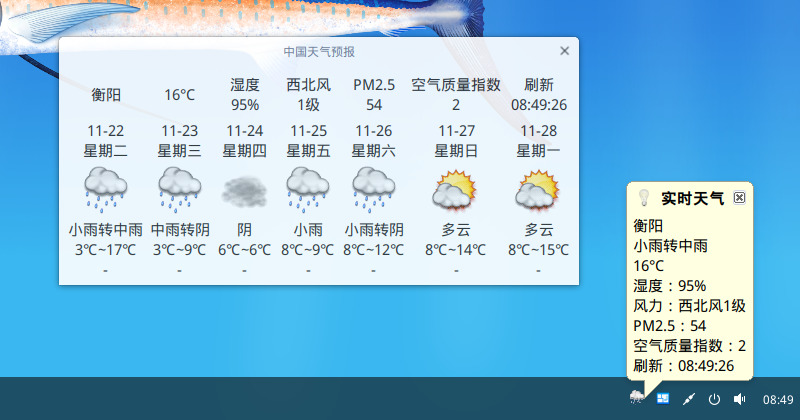

# Qt Weather Tray
托盘天气预报，每30分钟刷新一次，点击托盘显示实时天气，窗口预报7天天气。  
已编译好的 weatherTray 程序适用64位Linux系统。  

天气API：https://www.sojson.com/blog/305.html  
开机启动：把改好路径的 desktop 文件复制到 /home/administrator/.config/autostart 。